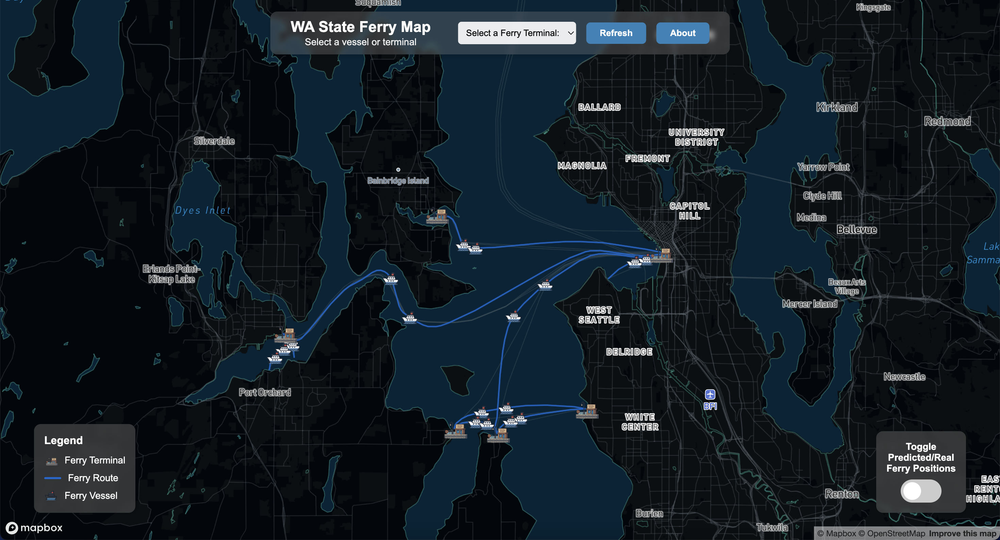
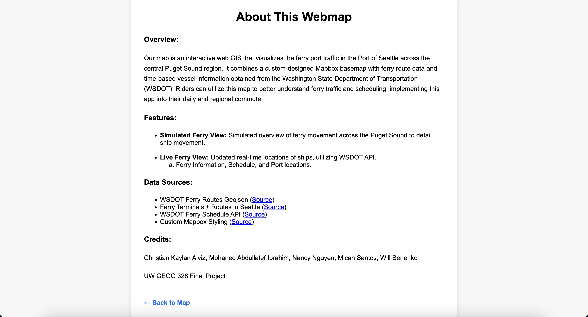

# Seattle Ferry Traffic Animation Map of Puget Sound

## Project Description
Our project is an interactive web GIS application that visualizes ferry traffic in the Port of Seattle and across the central Puget Sound region. The map combines a custom-designed Mapbox basemap with ferry route data and time-based vessel information obtained from the Washington State Department of Transportation (WSDOT). We designed the application to be lightweight, visually engaging, and easy to navigate, allowing users to observe how ferries travel throughout Puget Sound and how traffic patterns change over time.

The ferry system is an essential part of daily life in Washington State, especially around Seattle, Bainbridge Island, and the surrounding islands. While ferry schedules and ridership statistics are widely available online, our project provides a spatial and animated representation of actual vessel movement. This allows users to view intensity, directionality, and changes in ferry activity by day or by hour in a way that is more intuitive than static text or tables.

## Project Goal
The goal of this project is to use real-time data provided by WSDOT to give an accurate representation and animation of the ferry routes that are used in the Puget Sound area. The main message we want to convey is to show one of the many ways people travel around the Puget Sound area, how many people use these systems, and how extensive these systems are. 

## Application URL
https://christiankaylanuw.github.io/flow_map_g328/

## Favicon
Our custom favicon is a simplified version of our ferry icon. It is used across all pages of the application.

  

---
  
## Screenshots

Below are screenshots of the main map interface and the About page included in our application.

### Main Map View

  

### About Page

  

---

## Main Functions
- Custom dark-marine Mapbox basemap designed specifically for Puget Sound.
- A legend showing ferry terminals, ferry routes, and ferry vessels.
- Custom SVG ferry icon used both as the favicon and for vessel markers.
- Toggle between real-time vessel locations and simulated vessel movement.
- Dropdown menu for selecting ferry terminals and zooming into them.
- Updated schedule and departure information for selected terminals.
- Refresh functionality that updates vessel locations using the most recent data.
- Interactive map navigation through mouse and trackpad controls.
- **animateParticles():** Animates the simulated movement of ferries along travel paths.
- **loadFerryData():** Fetches API data and generates a GeoJSON object containing ferry locations and attributes including active status and associated terminals.
- **handleFerryData():** Loads and reloads real-time ferry location data by replacing old JSON data with new API responses and updating HTML as needed.
- **updateMap():** Loads ferry and terminal layers depending on which dataset (vessels or terminals) is selected.
- **handleTerminalData():** Creates GeoJSON objects for each terminal, populates the terminal dropdown list, and triggers the schedule loading process.
- **loadTerminalData():** Fetches and updates terminal schedule information from the WSDOT terminal API.
- **parseMSDate():** Reformats date values from the API into valid JavaScript Date objects.
- **updateTerminalInfo():** Builds and displays the daily schedule for a selected terminal in the sidebar.

---

## Data Sources

### **Ferry Routes in Seattle**  
https://geo.wa.gov/datasets/WSDOT::wsdot-ferry-routes/explore?location=47.590612%2C-122.422831%2C11.79  
**Description:**  
The WSDOT Ferry Routes dataset is a geospatial vector layer that maps the linear paths of Washington State’s public car ferry routes, including some tribal, private, and provincial services. Each route is represented as a line feature with attributes such as operator, State Route number, and route name. The dataset is designed for reference and mapping purposes, not for navigation, and helps users visualize and analyze ferry transportation networks across Washington’s coastal and inland waters.

---

### **Ferry Terminals & Routes**  
https://data.wsdot.wa.gov/arcgis/rest/services/Shared/FerryRoutes/MapServer  
**Description:**  
The dataset for Washington State Department of Transportation (WSDOT) titled “Ferry Routes (Public & Private)” is a geospatial feature layer portraying the routes of ferry services operating in Washington State’s waters. Represented as vector line features (polyline geometry), it includes scheduled car-ferry routes as well as known tribal, private, provincial and passenger-only ferry services. Attributes for each route include the operator (“Owner”), the State Route number if applicable (“SR”), and a label identifying the route terminals (“Display”). The layer is intended for reference and mapping in GIS applications—not for navigation—and supports queries in standard formats like JSON and GeoJSON. 

---

### **WSDOT Ferry Schedule API**  
https://www.wsdot.wa.gov/ferries/api/schedule/documentation/rest.html  
**Description:**  
The WSDOT Ferry Schedule API is a web-based service that provides real-time and scheduled information for Washington State Ferries. Instead of static GIS data, it delivers time-based, transactional data such as upcoming sailings, route schedules, terminal-to-terminal connections, valid schedule date ranges, and any service adjustments or cancellations. The API also returns details on each ferry route for a given date, including departure times, direction, and day-type schedules. In addition, it provides alerts about disruptions or changes affecting specific sailings. This dataset is intended for developers building applications that need live or scheduled ferry information, and access requires an API key from WSDOT.

---

### **Custom Mapbox Basemap**  
[https://api.mapbox.com/styles/v1/nancy324/cmhxwciko001u01sq7rf76i37.html](https://api.mapbox.com/styles/v1/nancy324/cmhxwciko001u01sq7rf76i37.html?title=view&access_token=pk.eyJ1IjoibmFuY3kzMjQiLCJhIjoiY21oMTEyejlmMDY1YzJycHVwYXVyZ2U1ZiJ9.YSOrhRs2Nuc7-00ALC3Q_w&zoomwheel=true&fresh=true#10.16/47.5851/-122.4341)  
**Description:**  
The link brings you to the preview of our basemap we are using for our website. The basemap is a custom map created in Mapbox. It is a dark-mode, ferry-focused map designed specifically for visualizing the Washington State ferry routes across Central Puget Sound. When the preview is open, search for Seattle, WA and you will be able to see the zoomed in portions of the layers we added in. This includes simplified land and water layers, the coastlines are highlighted, and we have a clean set of city names for geographic context. We also imported a custom SVG ferry icon so our final map can display moving ferries using the custom ferry icon we created. 

---

## Applied Libraries and Web Services

### **Mapbox GL JS**  
https://docs.mapbox.com/mapbox-gl-js/guides/  
The link above reroutes to mapbox’s guide to Mapbox GL JS. Mapbox GL JS is a Javascript library for creating, customizing, and displaying maps in a web browser or client. This is used in this project to display a custom map of the general area of Seattle along with the travel paths for ferries and creating markers for terminals by implementing data in between mapbox style layers.

### **Mapbox Studio**  
The map that we used from the service “Mapbox”, which is a powerful mapping and location tool that allows users to create custom maps for a variety of different use cases. For our case, we used mapbox to create a map with the dark overlay to allow the users to clearly see the visible ferry routes and port information.

### **GitHub & GitHub Pages**  
GitHub is an open-source version control platform used for sharing and keeping track of software code and projects. GitHub is utilized in this project to keep track of code updates and provide a database for project members to pull newly updated code, as well as make the website publicly accessible by establishing the repository’s main branch as the development source under pages settings.

---

## Acknowledgments
This project was created by **Nancy Nguyen**, **Mohaned Abdullatef Ibrahim**, **Christian Alviz**, **Will Senenko**, and **Micah Santos**, with guidance from **Dr. Bo Zhao** and **Hudson Dougan**.  
Data for the project was drawn from WSDOT’s open ferry terminal and route datasets, their ferry schedule API, and WSDOT’s ArcGIS REST Service Directory.

---

## AI Use Disclosure
- ChatGPT was used to debug the Mapbox basemap when a layer was not loading correctly.  
- ChatGPT generated the custom SVG ferry icon used for the moving markers and favicon.  
- ChatGPT was referenced to create a structural skeleton for the `about.html` page; however, all written content was original. 
